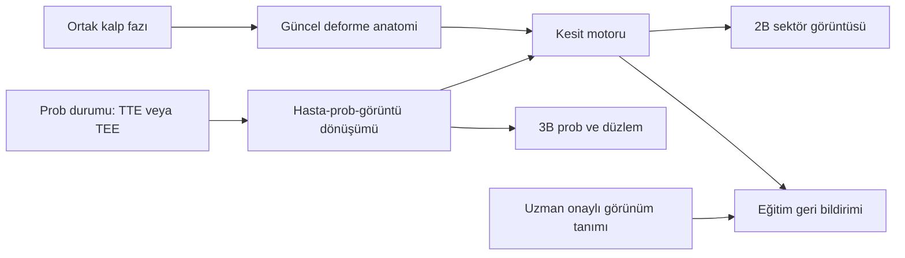

# TTE ve TEE simülatörü entegrasyon raporu

**Tarih:** 30 Eylül 2026 (uygulama durumu eklendi)  
**Proje:** Cardia, 3d card visualization  
**Karar:** Mevcut mimari anatomik kesit simülatörü entegrasyonuna elverişli; atlasın uygunluğu prototiple doğrulanmalı. Öneri, mevcut Three.js uygulamasına ortak bir eko modülü eklemek; ilk sürümü **prob-kesit-anatomi eğitimi** olarak tanımlamak. Gerçekçi B-mod, Doppler, klinik ölçüm ve fiziksel prob eğitimi sonraki aşamalar olmalı.

## Uygulama durumu (30 Eylül 2026)

Aşama 0–3 uygulandı; ayrıntı, koordinat sözleşmesi, kalibrasyon ve kontroller: `research/echo/README.md`.

- **Aşama 0:** atlas SHA-256 doğrulandı; 31 kesit mesh'inin 19'u açık yüzey; her görünümde açık/kapalı kontur sayıları `research/echo/topology-report.json` içinde. Lisans çözülmedi: modül yayın/dağıtım için hazır sayılmaz.
- **Aşama 1:** `src/echo-section.js` kesit motoru; asimetrik phantom ile yön (ayna), kopuk kontur, dünya matrisi ve güncel faz testleri (`scripts/test-echo-section.mjs`).
- **Aşama 2:** 8 TTE görünümü, pencere başına hazır nokta; rotasyon, tilt, rock ve kısa kaydırma; foreshortening geri bildirimi.
- **Aşama 3:** sol atriyum arkasında şematik özofagus-mide yolu; ilerletme, şaft rotasyonu, ante/retrofleksiyon, sağ/sol fleksiyon ve multiplan açısı ayrı kontroller; 8 TEE görünümü; 0/180° ayna testi.
- 16 hazır pozun tamamı, atımın beş fazında yapı ölçütlerini sağlıyor (otomatik atlas kalibrasyonu; uzman onayı yok). Kesit süresi geliştirme bilgisayarında 2–3 ms.
- **Yapılmadı:** Aşama 4 (eğitim pilotu), 5 (izinli klip/hacim, sentetik B-mod, patoloji) ve 6 (M-mode, Doppler, ölçüm, donanım); ekokardiyografi uzmanı değerlendirmesi; sabit test cihazında fps/gecikme ölçümü.

## 1. Kapsam ve kararın dayanağı

Araştırma sorusu: Mevcut 3B kalp uygulamasına transtorasik ekokardiyografi (TTE) ve transözofageal ekokardiyografi (TEE) hangi doğruluk düzeyinde, hangi ek bileşenlerle entegre edilebilir?

Bu çalışma kaynak kodu incelemesi, birincil kılavuz ve ürün belgeleri taraması, teknik seçenek karşılaştırmasıdır. Sistematik derleme veya eğitim etkinliği deneyi değildir. Bitiş ölçütü: uygulanabilir mimari, ilk sürüm kapsamı, veri/lisans engelleri, aşamalı plan ve doğrulama ölçütlerinin yazılması. Uygulama kodu değiştirilmedi; paket kurulmadı, veri satın alınmadı, hasta verisi indirilmedi.

**Önerilen ürün:** “Ekokardiyografi” modu altında TTE / TEE seçimi; solda prob, ultrason düzlemi ve 3B anatomi; sağda aynı düzlemden üretilmiş 2B sektör kesiti. Prob değiştikçe iki görünüm birlikte güncellenir. ECG ve kesit aynı kalp fazını kullanır. Mobilde üst-alt düzen veya sekmeler kullanılır.

Simülasyon eğitimi için bilimsel gerekçe var. SIMULATOR randomize çalışması TEE bilgi ve simülatör becerilerinde iyileşme bildiriyor. Bu sonuç, geliştireceğimiz tarayıcı aracının etkinliğinin kanıtı değildir; hasta başı bağımsız yetkinlik ve hasta sonuçlarına doğrudan genellenemez. [1]

## 2. Üç farklı ürün düzeyi

| Düzey | Kullanıcı ne öğrenir? | Gerekenler | Bu proje için karar |
|---|---|---|---|
| Anatomik kesit simülatörü | Prob yönü, kesit düzlemi, görünen yapılar, standart görünüm elde etme | Kalibre edilmiş yönler, prob kinematiği, mesh-düzlem kesişimi, eğitim senaryoları | **İlk sürüm için önerilen hedef** |
| Sentetik ultrason görünümü | Kazanç/derinlik etkisi, görüntü tanıma, bazı artefaktlar | Doku tanımları, tutarlı saçılma/attenüasyon modeli, görüntü doğrulaması | İkinci aşama; “sentetik” etiketi gerekli |
| Klinik gerçekliğe yakın eğitim sistemi | Patoloji, ölçüm, Doppler, zor pencereler, fiziksel prob becerisi | Uygun lisanslı hacimler/klipler, fizik veya doğrulanmış vekil model, vaka çeşitliliği, uzman değerlendirmesi; gerekirse donanım | Ayrı geliştirme ve doğrulama programı |

Kalbi siyah-beyaz göstermek veya rastgele benek eklemek ilk düzeyi gerçek ultrasona dönüştürmez. Hazır eko videosu da serbest prob hareketinin karşılığı değildir: kaydedilmiş tek düzlem dışındaki anatomiyi sağlayamaz. Bunlar teknik değerlendirmedir; bu çalışma içinde performans prototipi yapılmadı.

## 3. Mevcut uygulama ne sağlıyor?

Aşağıdaki bulgular yerel kaynak koduna dayanır. Satırlar inceleme tarihindeki çalışma ağacına aittir.

| Bileşen / kanıt | Kullanılabilir özellik | Sınır veya gereken iş |
|---|---|---|
| `package.json` | Three.js `^0.186.0`, Vite `^8.3.0`, JavaScript modülleri | İlk aşamada framework değişikliği gerekmiyor. Sürümler paket aralıklarıdır. |
| `src/atlas.js:3`, `src/heart.js:296` | Ortak GLB ve aynı koordinat sistemindeki kalp yapıları | `heart.js:309` çevresinde en büyük odacık boyutu 3.3 sahne birimine normalize ediliyor; doğrulanmış mm/cm ölçeği yok. |
| `src/heart.js:313`, `:322` | Atriyal düzenleme ve şematik AV yaprakçıkları | Model ham hasta segmentasyonu değil. Kesitlerin anatomik uygunluğu ayrıca denetlenmeli. |
| `README.md:14` | Modelin köken sınırlamaları açıkça kaydedilmiş | İlk incelemede üretici bilgisi yoktu. 2026-10-01 kullanıcı beyanıyla atlasın proje sahibinin özgün tasarımı olduğu kaydedildi; önceki lisans engeli geçersiz. |
| `src/thorax.js:24`, `:103` | Şematik diyafram, frenik sinirler ve vertebralar | TTE için göğüs yüzeyi, kosta/interkostal pencereler ve akustik engeller eksik. |
| `src/content.js:71` | Özofagusun modelde olmadığı açık | TEE için özofagus-mide güzergâhı ve anatomik ilişki gerekli. |
| `src/heart.js:210`, `:566` | Duvar kesme kontrolleri, clipping planes | Yarı uzayı gizler; dolu 2B doku kesiti veya ultrason sektörü üretmez. |
| `src/la-landmarks.js:104` | Özel bir yüzey-düzlem konturu hesabı | LAA boynuna özgü; genel kesit ve doku sınıflandırma motoru yerine kullanılamaz. |
| `src/cardiac-cycle.js:1`, `src/animation-channels.js:18` | Deterministik faz, durdurma, ilerletme, odacık/kapak hareketi | Kesit güncel deforme geometriyle aynı fazdan hesaplanmalı. |
| `src/hemo-mode.js:26`, `src/main.js:897`, `src/panel-shell.js:14` | Mod/panel yaşam döngüsü ve mobil panel kalıbı | Eko giriş/çıkışı görünürlük, kamera ve animasyon durumlarını doğru geri yüklemeli. |

**Sonuç:** UI ve animasyon temeli hazır; eko görüntü motoru hazır değil. Mevcut renkli kan akışını Doppler, basınç eğrilerini eko ölçümü olarak yeniden adlandırmak bilimsel olarak yeterli olmaz.

## 4. İlk sürümde TTE

Kılavuz dayanağı ASE 2019 kapsamlı erişkin TTE belgesidir. Parasternal, apikal, subkostal ve suprasternal pencereler; prob işaretçisi ve slide/rotate/tilt/rock hareketleri eğitim modeline alınmalı. Aşağıdaki liste bizim önerdiğimiz başlangıç alt kümesidir, kapsamlı incelemenin tamamı değildir. [2]

| Pencere | İlk görünüm seti | Ders hedefi |
|---|---|---|
| Parasternal | Uzun eksen (PLAX) | LV, mitral kapak, LVOT ve aort kökü ilişkisi |
| Parasternal kısa eksen | Aort kapağı, mitral kapak ve papiller kas düzeyleri | Aynı pencereyle farklı seviyelerin elde edilmesi |
| Apikal | Dört, iki ve üç boşluk | Rotasyon, gerçek apeks ve foreshortening ayrımı |
| Subkostal | Dört boşluk; sonraki adımda İVK görünümü | Septum ve venöz girişlerin yön ilişkisi |
| Suprasternal | Sonraki genişleme | Aort arkı ve dal ilişkileri |

Bu başlangıç listesinde **8 temel görünüm** bulunur: PLAX + 3 PSAX + 3 apikal + subkostal dört boşluk. Sayı bir kılavuz standardı değil, ürün kapsam seçimidir.

Kontroller: pencere seçimi, yüzey üzerinde sınırlı kaydırma, rotasyon, tilt/rock, sektör genişliği, göreli derinlik, dondur/oynat. Kalp etrafında kamera döndürmek ile prob hareketi ayrı kontroller olmalı. Göğüs modeli hazır olana kadar “hazır pencere konumları” kullanılabilir; bu sürüm serbest yüzey tarama becerisi öğrettiğini iddia etmemeli.

Önerilen görev: “Apikal dört boşluğu bul.” Geri bildirim yalnız prob açısı yakınlığına dayanmaz; gerekli yapıların görünmesi, yanlış yapıların kesite girmesi ve apeksin kısalmaması birlikte değerlendirilir. Eşikler uzmanla kalibre edilir.

## 5. İlk sürümde TEE

ASE/SCA 2013 belgesi kapsamlı inceleme için 28 görünüm tarif eder. Başlangıç modülümüz bunun seçilmiş alt kümesi olmalı. Elektronik multiplan açısı, şaft rotasyonu ve uç fleksiyonu farklı hareketlerdir. Tek “rotasyon” sürgüsüne indirgenmemeli. Hasta anatomisine göre ek hareket gerektiğinden bir açı tek başına görünüm garantisi değildir. [3]

**Önerilen 8 başlangıç görünümü:** midözofageal (ME) dört boşluk, mitral komissüral, iki boşluk, uzun eksen, aort kapağı kısa eksen, bikaval, LAA; transgastrik (TG) orta papiller kısa eksen. Bu seçim bizim eğitim önceliğimizdir.

Kontroller: özofagus yolu boyunca ilerlet/geri çek; şaftı sağa/sola döndür; antefleksiyon/retrofleksiyon; sağ/sol fleksiyon; elektronik multiplan açısı 0–180°. İlk sürümde derinlik “göreli konum” olmalı; doğrulanmış fiziksel model olmadan dişlerden ölçülen gerçek santimetre gibi sunulmamalı. [3]

Kalibrasyon örnekleri: ME uzun eksen için yaklaşık 120–140°, TG orta papiller kısa eksen için yaklaşık 0–20°. Bunlar klinik kılavuzdaki yaklaşık aralıklardır, sabit hedef koordinatları değildir. Tüm başlangıç pozları model üzerinde uzmanla ayarlanmalı. [3]

TEE için yalnız sol atriyum arkasına kamera koymak yetmez. Önerilen prob, anatomik olarak gerekçelendirilmiş özofagus-mide yolu üzerinde hareket eder; sektör prob ucundan çıkar. TG görünümü için mideye geçiş ve fleksiyon geometrisi gerekir. Bunlar henüz mevcut değil.

Mevcut transseptal, LAA ve mitral modülleri daha sonraki derslere bağlanabilir. Önce görünüm yönleri doğrulanmalı; ekrana gelen kesit girişimsel güvenlik doğrulaması sayılmamalı. Fiziksel giriş, kuvvet hissi ve direnç tarayıcı kontrolleriyle öğretilmiş kabul edilmemeli.

## 6. Kesit ve görüntü üretimi seçenekleri

### A. Mevcut yüzeylerden anatomik kesit, önerilen başlangıç

Prob yerel koordinatında sektör düzlemi tanımlanır; animasyon sonrasındaki mesh üçgenleriyle kesişimler bulunur. Segmentler konturlara birleştirilir, geçerli konturlar doku/boşluk anlamına göre boyanır ve sektör içine çizilir.

**Ana risk:** Açık, birbirini kesen veya yalnız tek yüzey içeren meshlerden doğru miyokard kalınlığı kendiliğinden çıkmaz. İlk prototipte topoloji denetlenmeli; kapatılamayan konturlarda uydurma dolgu yerine kontur gösterimi ve açık sınırlama kullanılmalı. Büyük atlas değişiklikleri ayrı karar gerektirir.

Render target, ayrı görüntü paneli üretmeye yardımcı olur; kendisi kesit hesaplamaz. Three.js bu render-to-texture altyapısını sağlıyor. [4]

### B. Lisanslı 3B/4B hacimden yeniden kesitleme

Voksel verisinden oblique MPR, serbest düzleme daha doğal karşılık verir. vtk.js `ImageResliceMapper` hacimlerden donanım hızlandırmalı kesit sağlıyor; olası ikinci aşama aracıdır. Mevcut GLB bir voksel hacmi olmadığı için doğrudan bu araca verilmez. [5]

Gerçek 3B eko hacmi, elde edildiği görüş alanı ve görüntü kalitesiyle sınırlıdır. O hacmin dışında hayali anatomi üretilmemeli. CT/MR kesiti de ultrason görüntüsü değildir. Zaman serisi ve fiziksel voxel spacing korunmalıdır. Eşleştirilmemiş hasta klibi ile mevcut atlas “aynı anatomi” gibi sunulmamalı.

### C. Akustik simülasyon

PLUS, yüzey modellerinden ultrason görüntüsü üretmek için belgelenmiş bir simülatör içeriyor; hareketli modeller ve görüntü/izleme dönüşümleri araştırılabilir. Bu C++/VTK ekosistemi hazır bir Three.js bileşeni değildir. Yerel servis, iletişim köprüsü ve bağımlılık/lisans denetimi gerekir. Bu projede kurulup denenmedi. [6]

k-Wave, akustik dalga yayılımı ve B-mod örnekleri olan MATLAB/C++ araç takımıdır; toolbox LGPL altında dağıtılır. Akustik yöntem araştırması ve çevrimdışı örnek üretimi için adaydır. Mevcut donanımda hız ölçülmedi; tarayıcıda gerçek zamanlı çalışacağı varsayılmamalı. [7]

**Seçim:** Önce A; A topolojik olarak yetersiz kalırsa anatomik model iyileştirmesi veya B için ayrı karar. C ilk sürümün önkoşulu yapılmamalı.

## 7. Hazır çözümler ve yeniden kullanım

| Kaynak | Doğrulanan özellik | Bizim projeye uyum / karar |
|---|---|---|
| Toronto/UHN Virtual TTE ve TEE | 3B anatomi ile eko görüntüsünü ilişkilendiren eğitim modülleri; standart görünüm modüllerinde HTML5 dönüşümü duyurulmuş | Eğitim tasarımı için iyi referans. İçerik telifli; ücretsiz erişim yeniden dağıtım izni değildir. Gömme/API izni doğrulanmadı. [8] |
| HeartWorks, Surgical Science | TTE/TEE anatomi ve eko eğitim ürünü; ayrıca 3B eko modülü | Ticari sistem karşılaştırma ölçütü. İncelenen sayfalarda bu uygulamaya gömülebilir kamuya açık SDK/API doğrulanmadı. “API yok” sonucu çıkarılmadı. [9] |
| Vimedix, Elevate Healthcare | TTE/TEE, 3B/4B görüntüleme ve performans izleme özellikleri | Hazır donanımlı eğitim alternatifi. Yerel JS entegrasyonu, lisans, Türkiye desteği ve fiyat için üretici teyidi gerekir; teklif alınmadı. [10] |
| SlicerHeart | 3D Slicer tabanlı kardiyak görüntü analiz/modelleme; BSD-3-Clause | Veri hazırlama, hacim inceleme ve uzman doğrulamasında yararlı. Web simülatörü olarak doğrudan gömülmez. Veri lisansları yazılım lisansından ayrıdır. [11] |
| PLUS / k-Wave | Görüntü simülasyonu ve akustik araştırma altyapısı | Gelişmiş aşama adayları; hazır kapsamlı TTE/TEE eğitim paketi değil. [6,7] |
| `osamamalik/TEESimulator` | Arduino/mouse sensor + C++/VTK prototipi; README ultrason üretimini gelecek iş olarak anlatıyor | Hazır eko motoru olarak seçilmemeli. Kod ve görüntülerin yeniden kullanım lisansı bu taramada doğrulanmadı. [12] |

Toronto TEE sitesinin 20 standart görünüm içeren eğitim modülü ile ASE 2013'ün 28 görünüm kapsamı aynı liste değildir. Eski bir alt modülün Flash uyarısından bütün sitenin çalışmadığı sonucu çıkarılmamalı; standart görünüm modülleri için HTML5 duyurusu mevcut. Bu taramada etkileşimli modüller tarayıcıda çalıştırılmadı. [3,8]

**Hazır siteyi iframe ile gömmek ana öneri değil:** izin, frame politikası, çevrimdışı erişim, Türkçeleştirme ve ortak prob/kalp fazı kontrolü doğrulanmadan bütünleşik simülatör sözü verilemez. Kaynağa bağlantı vermek ile içerik/asset kopyalamak ayrı işlerdir.

## 8. Veri ve lisans kapıları

1. **Mevcut atlas:** Kaynağı ve lisansı proje README'sinde belirsiz. Bu inceleme lisansı çözmedi. Araştırma önerisi yeni yayın izni sağlamaz.
2. **Kılavuz görselleri:** ASE, kılavuz şekil/tablo kullanımı için yayınevi izin yolunu gösteriyor. Metinden özgün eğitim senaryosu geliştirmek ile şekil kopyalamak ayrılmalı. [13]
3. **EchoNet-Dynamic:** Apikal dört boşluk video veri seti; serbest 3B TTE/TEE hacmi değil. Resmî anlaşma kişisel, ticari olmayan araştırmayı sınırlar ve izinsiz yeniden dağıtımı yasaklar. Uygulamanın herkese açık vaka kütüphanesine doğrudan paketlenmemeli. [14]
4. **CAMUS:** Apikal iki/dört boşluk segmentasyon verisi; genel TEE veya serbest tarama kaynağı değil. Bu araştırmada uygulama içinde yeniden dağıtım hakkı doğrulanmadı. [15]
5. **Kurumsal gerçek eko klipleri:** Eğitim/yayın izni, anonimleştirme, DICOM başlıkları ve görüntü üzerindeki kimlik yazıları kontrol edilmeden içeri alınmamalı. Bu turda hiçbir hasta verisi işlenmedi.

Kısa vadede lisansı açıklığa kavuşturulmuş anatomik model + özgün şematik kesit en yönetilebilir seçenek. Gerçek klipler daha sonra ayrı “referans kayıt” panelinde, veri kaynağı ve kullanım hakkıyla gösterilebilir.

## 9. Önerilen yazılım mimarisi

Aşağıdaki dosyalar **öneridir; oluşturulmadı**:

| Modül | Sorumluluk |
|---|---|
| `echo-mode.js`, `echo-panel.js` | TTE/TEE seçimi, panel yaşam döngüsü, mobil düzen, dondur/oynat |
| `echo-probe.js` | TTE yüzey kısıtları; TEE yol ve fleksiyon kinematiği |
| `echo-views.js` | Görünüm adı, kaynak sürümü, prob işaretçisi, hedef yapılar ve uzman onaylı preset |
| `echo-section.js` | Düzlem-kesişim, kontur birleştirme, geçersiz topoloji tespiti |
| `echo-renderer.js` | Sektör gösterimi; renkli anatomi / şematik gri görüntü |
| `echo-training.js` | Görevler, ipuçları, açıklanabilir hata geri bildirimi |
| `research/echo/` | Kaynak/lisans kaydı, görünüm doğrulama tutanakları ve test referansları |

Üç koordinat sistemi açıkça ayrılmalı: hasta, prob ve 2B ekran. Mevcut kodda kullanılan sağ/sol ve ön/arka yönler yazılı sözleşmeye dönüştürülmeli. Ekran işaretçisi ve TEE multiplan yönü için asimetrik test anatomisi kullanılmalı; yalnız simetrik kalp görünümü ayna hatasını yakalamaz.

Kesit hesaplaması kalp deformasyonundan sonra, aynı fazda çalışmalı. Dondurma hem 3B hem 2B görüntüyü tutarlı durdurmalı. İlk performans hedefleri ürün kabul hedefi olarak konulabilir: seçilen masaüstü test cihazında en az 30 fps, prob-görüntü gecikmesinde 100 ms altında yüzde 95 dilimi. Bunlar ölçülmüş sonuç veya klinik eşik değildir; cihaz, çözünürlük ve ölçüm yöntemi prototipte sabitlenmeli.

## 10. Aşamalı uygulama ve doğrulama

| Aşama | Teslim | Geçiş ölçütü / planlanan kontrol |
|---|---|---|
| 0. Kaynak ve anatomi denetimi | Lisans kaydı, yönler, ölçek durumu, mesh/topoloji raporu | GLB checksum; kesişim konturlarının açık/kapalı oluşu; uzmanla model uygunluğu. Dağıtım izni belirsizse yayın yapılmaz. |
| 1. Ortak kesit prototipi | Tek sabit görünümde 3B düzlem + 2B kontur | Sentetik asimetrik phantom ile yön testi; kopuk kontur testi; aynı faz testi. Önerilen komut: `node scripts/test-echo-section.mjs`. |
| 2. TTE başlangıç modülü | 8 temel görünüm ve prob kontrolleri | Her görünümde gerekli yapılar, foreshortening geri bildirimi; `npm run check`, `npm test`, `npm run build`; önerilen `test:echo` tarayıcı testi. |
| 3. TEE başlangıç modülü | Özofagus-mide yolu, ayrı hareket kontrolleri, 8 görünüm | 0/90/180° yön testleri; TTE/TEE geçişi; TG erişimi; uzman görüntü kontrolü. |
| 4. Eğitim pilotu | Öğren/serbest tara/görünümü bul akışı | Ön test, son test ve gecikmeli değerlendirme; hedef kitle, puanlama ve örneklem planı uygulama öncesi belirlenir. |
| 5. Gerçekçilik ve vakalar | İzinli referans klip veya hacim, sentetik B-mod, seçilmiş patoloji | Klinik eşleştirme ve görüntü doğrulaması; her varlığın veri kökeni ve lisansı. |
| 6. İleri modlar | M-mode, renkli/spektral Doppler, ölçüm, donanım | Her biri ayrı fizik/veri ve doğrulama kapısı; ilk sürümün otomatik uzantısı kabul edilmez. |

M-mode, seçilen ışın boyunca zaman serisi gerektirir. Doppler için akışın ışın doğrultusundaki bileşeni ve uygun örnekleme modeli gerekir; mevcut akış partiküllerinin rengi yeterli değildir. EF fiziksel ölçekten bağımsız bir oran olsa da geçerli hacim geometrisi ve doğrulanmış hareket modeli gerektirir. cm/mm ölçümünde ayrıca fiziksel kalibrasyon şarttır. İlk sürüm bu ölçümlere klinik doğruluk iddiası eklememeli.

**Emek değerlendirmesi:** Birkaç UI kontrolü eklemekten büyük; yeni görüntü motoru ve anatomi doğrulaması içeren iş. Aşama 0–1 tamamlanmadan takvim/fiyat vermek güvenilir olmaz. Prototipin darboğazları belirlendikten sonra geliştirici ve eko uzmanının görevleriyle iş günü tahmini çıkarılmalı. Bu rapor satın alma teklifi veya teslim tarihi değildir.

## 11. Doğrulama kaydı ve belirsizlikler

- Yerel kod incelemesi ayrı araştırma alt göreviyle yapıldı. Proje kod grafiğinde bulunamadı; kaynak dosyalara geçildi.
- ASE TTE ve TEE resmî sayfaları/PDF'leri, JAMA birincil çalışma sayfası, üretici belgeleri ve araçların resmî depoları okundu. Arama sonuçları tek başına ürün çalışabilirliği kanıtı sayılmadı.
- Scite ile üç ana makalenin DOI/metaverisi kontrol edildi. SIMULATOR çalışmasına yönelik atıf bağlamları okundu: görüntülenen yorum, simülatör öğrenmesi ile gerçek hasta başı performansını ayırıyor. Atıfların çoğunun “mentioning” olması bağımsız doğrulama değildir.
- Scite grafik sorgusu sekiz bağlantıyla sınırlandı ve kesildi; iki kılavuz için kapsama yetersizdi. Bu sonuç tam atıf veya çelişki taraması değildir. Metaveri yanıtında editorial notice alanı dönmedi; “düzeltme/retraction yok” sonucu çıkarılmadı.
- İncelenen ASE yapısal girişim TEE tarama sayfasında 2022 düzeltme bildirimi var. Bu rapor kapsamlı TEE temel çerçevesini 2013 belgesinden alır; sonraki girişim modülü için yapısal kılavuz ve düzeltmesi birlikte okunmalı. [16]
- Yeni simülatör çalıştırılmadı; fps, gecikme, eğitim etkisi veya tanısal doğruluk ölçülmedi. Kod değiştirilmediği için uygulama testleri yeniden çalıştırılmadı. Mevcut testlerin geçmiş geçişi eko modülünün doğrulanması anlamına gelmez.
- Çalışma ağacı önceki değişiklikleri içeriyor. İncelenen kaynakların SHA-256 değerleri ve araştırma kayıtları eşlik eden `tte-tee-research-provenance.json` dosyasında saklanır.
- Ayrı yapay zekâ incelemesi 28 TEE görünümü, örnek açı aralıkları, EchoNet kullanım sınırları ve SIMULATOR sonlanımının simülatör üzerinde ölçülmesini kaynaklardan kontrol etti; engelleyici hata bildirmedi. İnsan ekokardiyografi uzmanı doğrulamasının yerine geçmez.

**Önerilen sonraki karar:** Lisans/topoloji denetimi ve tek düzlem kesit prototipiyle başla. Başarılıysa aynı motorla TTE ve TEE başlangıç modüllerini kur. Hazır ticari simülatör veya dış siteden içerik kopyalamayı varsayılan entegrasyon yolu yapma.

## Kaynaklar

Tüm çevrimiçi kaynaklara erişim: 30 Eylül 2026. Kaynaklar ilk kullanım sırasındadır.

1. Pezel T, Dreyfus J, Mouhat B, ve ark. **Effectiveness of Simulation-Based Training on Transesophageal Echocardiography Learning: The SIMULATOR Randomized Clinical Trial.** JAMA Cardiol. 2023;8:248–256. DOI: [10.1001/jamacardio.2022.5016](https://jamanetwork.com/journals/jamacardiology/fullarticle/2800011). Bulgular ve Limitations bölümü.
2. Mitchell C, Rahko PS, Blauwet LA, ve ark. **Guidelines for Performing a Comprehensive Transthoracic Echocardiographic Examination in Adults.** JASE. 2019;32:1–64. DOI: 10.1016/j.echo.2018.06.004. [ASE sayfası](https://www.asecho.org/guideline/comprehensive-tte-in-adults/), [resmî PDF](https://www.asecho.org/wp-content/uploads/2025/04/2019_Comprehensive-TTE.pdf). Nomenclature ve inceleme görünümleri. URL'deki 2025 klasörü yayın yılı değildir.
3. Hahn RT, Abraham T, Adams MS, ve ark. **Guidelines for Performing a Comprehensive Transesophageal Echocardiographic Examination.** JASE. 2013;26:921–964. DOI: 10.1016/j.echo.2013.07.009. [ASE özeti](https://www.asecho.org/guideline/comprehensive-tee/), [resmî PDF](https://www.asecho.org/wp-content/uploads/2014/05/2013_Performing-Comprehensive-TEE.pdf). Instrument Manipulation, s.931; kapsamlı inceleme, s.932 ve devamı; ME LAX s.937, TG SAX s.940.
4. Three.js. [Render Targets](https://threejs.org/manual/pages/rendertargets.html). Teknik altyapı belgesi.
5. Kitware vtk.js. [ImageResliceMapper](https://kitware.github.io/vtk-js/api/Rendering_Core_ImageResliceMapper.html). Hacim kesitleme API'si.
6. PLUS Toolkit. [Features](https://plustoolkit.github.io/features), [Ultrasound Simulator cihaz belgesi](https://github.com/PlusToolkit/PlusLib/blob/master/docs/devices/DeviceUsSimulatorVideo.md). Kaynak sürümü geliştirme öncesinde sabitlenmeli.
7. k-Wave. [Araç takımı](https://www.k-wave.org/), [B-mode örneği](https://www.k-wave.org/documentation/example_us_bmode_linear_transducer.php), [lisans](https://www.k-wave.org/license.php).
8. University of Toronto / University Health Network. [Virtual TTE](https://pie.med.utoronto.ca/tte/index.htm), [Virtual TEE](https://pie.med.utoronto.ca/TEE/index.htm). HTML5 duyuruları ve telif notları.
9. Surgical Science. [HeartWorks](https://surgicalscience.com/simulators/heartworks/), [Live 3D Echo](https://surgicalscience.com/simulators/heartworks/3d-echo/). Özellikler üretici beyanıdır; uygulama API'si doğrulanmadı.
10. Elevate Healthcare. [Vimedix](https://elevatehealth.net/product/vimedix/). Özellikler üretici beyanıdır; fiyat ve yerel destek doğrulanmadı.
11. SlicerHeart. [Resmî depo](https://github.com/SlicerHeart/SlicerHeart), [BSD-3-Clause lisansı](https://github.com/SlicerHeart/SlicerHeart/blob/master/LICENSE).
12. Osama Malik. [TEESimulator deposu](https://github.com/osamamalik/TEESimulator). README, Simulation Software ve Future bölümleri.
13. ASE. [Guidelines ve görsel/tablo kullanım izni açıklaması](https://www.asecho.org/practice-clinical-resources/ase-guidelines/).
14. Stanford. [EchoNet-Dynamic ve Research Use Agreement](https://echonet.github.io/dynamic/).
15. CREATIS. [CAMUS amaç ve kapsamı](https://www.creatis.insa-lyon.fr/Challenge/camus/scientificInterests.html), [birincil çalışma](https://www.creatis.insa-lyon.fr/Challenge/camus/files/tmi_2019_leclerc.pdf). DOI: 10.1109/TMI.2019.2900516.
16. ASE. [TEE Screening for Structural Heart Intervention](https://www.asecho.org/guideline/tee-screening-for-structural-heart-intervention/). Sayfada bağlantılanan düzeltme: [10.1016/j.echo.2022.01.011](https://doi.org/10.1016/j.echo.2022.01.011).
