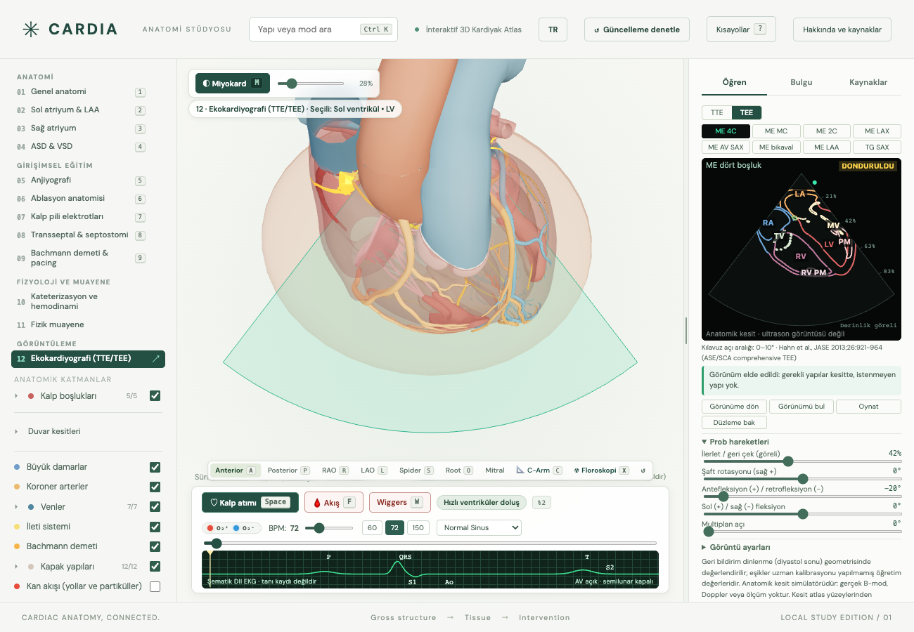

# TTE ve TEE modülü: inceleme ve iyileştirme raporu

Tarih: 30 Eylül 2026. Kapsam: mevcut uygulama, geometri, prob hareketleri, görünüm değerlendirmesi, eğitim dili ve doğrulama. Bu çalışma uygulama kodunu değiştirmez. İnceleme sırasında çalışma ağacında başka değişiklikler bulunduğundan bulgular bu tarihteki dosyalara aittir.

**Karar:** Modül, 3B kalp ile 2B anatomik kesit ilişkisini öğretmek için kullanılabilir bir temel sunuyor. Klinik ultrason veya fiziksel prob kullanımı yeterliliğini doğrulayan simülatör düzeyinde değil. Öncelik yeni görünüm sayısını artırmak değil, yanlış başarı mesajlarını ve prob hareketleri arasındaki karışmayı gidermek olmalı.

## Uygulama durumu (30 Eylül 2026)

Uygulama sırasının 1. adımı (puanlama ve dil) tamamlandı; 2. adımın (prob davranışı) kod bölümü uygulandı, uzman onayı yok. 3. ve 4. adımlar (bağımsız uzman doğrulaması, lisans, gerçek klip) kodla kapanamaz ve açık kaldı.

| Bulgu | Yapılan | Test |
|---|---|---|
| P1 apeks kırpılınca başarı | LV uzunluğu yalnız sektör ve derinlik içindeki kontura göre ölçülür. Üç ayrı ölçüt ve mesaj: kesit apeksten geçmiyor; apeks düzlemde ama derinlik dışında ("derinliği artırın"); apeks düzlemde ama sektör dışında; görünen LV kısalmış. A4C prob yerleşimi apekse taşındı (önceden apeks sektörün 67° yanındaydı). | `test-echo-training.mjs`: raporun karşı örneği (derinlik 0.6) reddedilir, derinlik 1.2'de kabul edilir; sektör ve düzlem dışı karşı örnekleri |
| P1 bikaval koşulu | İVK ağzı (atlasta İVK mesh'i yok; kestirilen nokta) kesitte ve görüntüde olmalı; LA ile RA konturlarının komşuluğu (interatriyal septum) görünmeli. Eksikse "tam bikaval görünüm sayılmaz" denir. Hazır poz yeniden kalibre edildi. | İVK düzlem dışı ve LA-RA ayrık karşı örnekleri reddedilir |
| P1 lateral fleksiyon = multiplan | TEE ucunda 2 cm (0.6 birim) distal bükülme segmenti: ante/retro ve sağ/sol fleksiyon segmenti yay biçiminde büker, uç konumu ve yönü değişir; özofagusta uç en çok 0.3 birim (lümen), midede 1.2 birim yana gidebilir, fazlasında bükülme sınırda durur. Multiplan açısı ucu ve merkez ışını değiştirmez. | Lateral 20° ile multiplan 20° farklı uç konumu; multiplan ucu/ışını korur; lümen sınırı; mide daha fazla izin verir |
| P2 komissüral / 2C aynı yapılar | Mitral kesit yönü: düzlemin anulusla kesişim kirişinin komissür eksenine (aort yönüne dik) açısı; düzlem anulus merkezinden geçmeli. Komissüral 0–22°, 2C ≥ 25° ve aort çıkış yolu olmamalı, LAX 55–90° ve aort gerekli. Bu atlasta özofagus LV uzun ekseniyle hizalı olmadığından apeksten geçen 2C kesiti anulusu büyük açıyla keser; 2C ile LAX aort çıkış yoluyla ayrılır. Uzman etiketli örnek çiftleri yok. | Uzun eksen kesiti komissüral sayılmaz; anulus kenarından geçen düzlem "merkezde değil" |
| P2 açı etiketleri | Panel "Atlas başlangıç açısı" ile "ASE/SCA yaklaşık aralığı"nı ayrı yazar; ME4C için 10–20° ayar, LAA için 90–110° başlangıç ve çok açılı tarama notu. Açı kimlik anahtarı değildir. | |
| P2 kesin dil | "Görünüm elde edildi" yerine "Modelin başlangıç ölçütleri karşılandı (diyastol sonu geometrisi)"; "Model ölçütüne göre eksik / beklenmeyen". | `test-echo.cjs` |
| P2 görev ve anlık durum | "Görev tamamlandı" ayrı satırda kalır; geri bildirim kutusu şu anki kesitin durumunu gösterir. | `test-echo.cjs` |
| P2 TTE temas | Kalbi saran şematik elipsoid göğüs yüzeyi (0.35 birim duvar payı); prob yüzeye oturur, kaydırmada yüzeyde kalır; 3B sahnede silik tel kafes. Kaburga, interkostal aralık ve akustik pencere yok; metin kontrollerin interkostal yerleşimi temsil etmediğini söyler. | Kaydırmadan sonra orijin elipsoid üzerinde |
| P2 sentetik TEE yolu | Panelde "Şematik özofagus-mide yolu" yazılır; sınır metni bükülme ve lümen modelini açıklar. | |
| Etiket yoğunluğu | Etiketler yapının sektördeki en uzun görünür kontur parçasının ortasına konur; sektör "Büyüt" ile 440 px olur. | Dondurulmuşken büyütme testi |
| Test açıkları | 16 görünüm × 4 faz; sabit tohumlu görev başlangıcı; yalnız klavye ile görev çözümü; mobil taşma; dondurulmuş görüntüde yeniden boyutlandırma; kaydırıcıdan görüntüye p95 gecikmesi (bu makinede 7.3 ms; referans cihaz ölçümü değildir). | `npm run test:echo` |

Kalibrasyon: 16 hazır pozun tamamı yeni ölçütleri dinlenmede ve dört faz boyunca sağlar (`scripts/echo-calibrate.cjs`). Bu iç tutarlılıktır; bağımsız anatomik doğruluk kanıtı değildir.

## 1. Çalışan temel

- Sekizer TTE ve TEE görünümü, prob kontrolleri, kesit sektörü, etiketler, dondurma ve görünümü bulma görevi mevcut.
- Kesit görüntüsü gerçek üçgen-düzlem kesişiminden üretiliyor; yalnızca 3B modelin ekrana izdüşümü değil (`src/echo-section.js:57`).
- Açık konturlar çizgi olarak bırakılıyor; yalnızca kapalı boşluk konturları dolduruluyor (`src/echo-renderer.js:203`). Bu ayrım korunmalı.
- Görüntünün anatomik şema olduğu belirtiliyor. Fiziksel ölçek doğrulanmadığından derinliğin göreli gösterilmesi uygun.
- Sekiz TEE görünümü başlangıç eğitim alt kümesi olarak tanımlanmış. Kapsamlı protokoldeki bütün görüntülerin bulunmaması tek başına hata değil. [ASE kapsamlı TEE protokolü](https://www.asecho.org/guideline/comprehensive-tee/)

## 2. Öncelikli bulgular

P1: ilgili beceri için eğitim puanlamasından önce giderilmeli. P2: sonraki geliştirme aşamasında ele alınmalı. Bunlar ürün incelemesi öncelikleridir; klinik risk sınıflaması değildir.

### P1: Apeks görüntü dışında kalırken başarı verilebiliyor

**Kanıt:** `src/echo-training.js:33` foreshortening hesabında sektör ve derinlik sınırlarıyla kırpılmamış LV konturunu kullanıyor. Görünür yapı hesabı ise kırpılmış konturu kullanıyor (`:49`).

**Tekrarlama:** Sentetik LV çizgisi `[0,0.2] → [0,1]`, görüntü derinliği `0.6`, sektör `π/2`, mitral merkez başlangıçta, apeks `[0,1,0]`, LV uzunluğu `1`. Apeks görüntü derinliğinin dışında olduğu halde sonuç `achieved:true`, uzunluk oranı `1`, görünür kontur uzunluğu yaklaşık `0.4`. Örnek değerlendirme kuralı `required:["lv"], avoid:[], apical:true`; çerçeve `origin=[0,0,0], lateral=[1,0,0], beam=[0,1,0], normal=[0,0,1]`. Bu, minimal hesaplama örneğinde doğrulanmış hata; gerçek atlas üzerinde klinik vaka doğrulaması değildir.

**Öneri:** Apeksin düzleme yakınlığı, görüntü sınırları içinde kalması ve gerçek uzun eksenin yakalanması ayrı ölçütler olsun. “Derinlik yetersiz” ile “kesit apeksten geçmiyor” farklı geri bildirim üretmeli.

**Kabul:** Apeksi derinlik veya sektör nedeniyle kırpılan tüm karşı örnekler başarısız olmalı; yeterli derinlikte doğru kesit tekrar başarılı olmalı.

### P1: Bikaval görünümün başarı koşulu eksik

**Kanıt:** `src/echo-views.js:33` yalnızca LA, RA ve SVC gerektiriyor. IVC ile interatriyal septum değerlendirmeye girmiyor. Bikaval eğitiminde her iki kaval bağlantı ve septumun tanınması gerekir. [ASE/SCA 2013, PDF s.18](https://www.asecho.org/wp-content/uploads/2014/05/2013_Performing-Comprehensive-TEE.pdf)

**Öneri:** IVC, SVC, RA ve septum ilişkisini ölçüte ekle. Atlas bu ayrımı desteklemiyorsa “sınırlı bikaval şema” göster; tam görünüm başarısı verme.

**Kabul:** IVC veya septumun bulunmadığı karşı örnek tam puan alamamalı. Başarı yalnızca etiket varlığına değil, uygun anatomik ilişkiye dayanmalı.

### P1: TEE lateral fleksiyon ile elektronik multiplan dönüş birbirine eşleniyor

**Kanıt:** `src/echo-probe.js:129` lateral fleksiyonu sabit yüzey yönü etrafında şaft dönüşü olarak kuruyor. Düz prob yolunda `advance:0.5`, `lateralFlexion:20, omega:0` ile `lateralFlexion:0, omega:20` aynı origin, beam, lateral ve normal vektörlerini üretiyor; en büyük bileşen farkı `0`.

**Öneri:** Mekanik uç bükülmesini sonlu uzunlukta distal segmentle modelle. Bükülme uç konumunu ve fiziksel prob yönünü değiştirmeli; elektronik multiplan dönüş fiziksel ucu değiştirmemeli. Bu değişiklik yeni mimari çalışma olarak ayrıca planlanmalı.

**Kabul:** İki hareketin eşdeğer olmadığı geometri testi; multiplan dönüşte uç konumu ve merkez ışının korunması; bükülmede izin verilen lümen sınırlarının aşılmaması. Mevcut model bu düzeye gelene kadar kontroller şematik olarak tanımlanmalı.

## 3. Eğitim doğruluğu ve model sınırları

| Öncelik | Bulgu ve kanıt | Önerilen iyileştirme |
|---|---|---|
| P2 | ME komissüral ve ME2C aynı LA/LV/mitral yapı listesine dayanıyor; komissür veya yaprakçık segmenti kontrolü yok (`echo-views.js:29`). | Görünüm kimliğine özgü anatomik işaretler; uzman etiketli doğru/yanlış örnek çiftleri. Açı tek başına yeterli sayılmamalı. |
| P2 | Panel ME4C için 0–10°, LAA için 60–90° değerlerini “kılavuz” aralığı olarak sunuyor (`echo-views.js:28`, `:34`; `echo-panel.js:160`). | Atlas başlangıç açısı, klinik öneri aralığı ve çok açılı tarama ayrılmalı. ASE metni ME4C için 10–20° ayarlama gerekebileceğini, başlangıç LAA yaklaşımı için 90–110° tarifini içerir. Mevcut 0° veya 60° kesitin bu nedenle yanlış olduğu ileri sürülmemeli. |
| P2 | Kontur uzunluğu eşiğinden kesin “Görünüm elde edildi” ve “Bu görünümde olmamalı” ifadeleri çıkıyor (`echo-training.js:59`). | “Modelin başlangıç ölçütleri karşılandı” gibi doğrulama düzeyine uygun dil; eksik yapıya göre açıklama. |
| P2 | Başarı istirahat geometrisiyle, görüntü canlı fazla hesaplanıyor (`echo-mode.js:115`, `:134`). | Referans fazı alt açıklamada zaten belirtiliyor. Bunu başarı mesajının yanında da göster; canlı görüntüdeki anlık yapı görünürlüğüyle karıştırma. |
| P2 | Tamamlanan görev yeşil kalırken sonraki hareketlerde eksik yapı mesajı çıkabilir (`echo-mode.js:138`, `echo-panel.js:162`). | “Görev tamamlandı” geçmiş başarısı ile “şu anki kesit uygunluğu” iki ayrı durum olsun. |
| P2 | TTE kaydırması düz teğet düzlemde; göğüs yüzeyi, kaburga ve akustik pencere teması yok (`echo-probe.js:39`). | Önce göğüs temas modeli, sonra pencere ve hareket eğitimi. Mevcut kontrollerin interkostal yerleşimi temsil ettiği söylenmemeli. |
| P2 | TEE fleksiyonunda uç noktası sabit; özofagus/mide yolu sentetik (`echo-probe.js:120`, `echo-anatomy.js:107`). | Sentetik yol açıkça işaretlensin. Fiziksel yerleştirme eğitiminden önce distal bükülme ve temas modeli eklensin. |

Klinik görünüm ve açı karşılaştırmalarının kaynağı: [ASE/SCA kapsamlı TEE, 2013, PDF s.11–18](https://www.asecho.org/wp-content/uploads/2014/05/2013_Performing-Comprehensive-TEE.pdf). Açı aralıkları hasta anatomisine göre değişebilir; yazılımda kesin kimlik anahtarı yapılmamalı.

Apikal eğitimde LV ve LA optimizasyonu ayrı hedefler olarak tasarlanmalı. Tek LV uzunluk ölçütü atriyal görüntü kalitesini doğrulamaz. [ASE kapsamlı TTE, 2019, PDF s.29](https://www.asecho.org/wp-content/uploads/2019/01/2019_Comprehensive-TTE.pdf)

## 4. Anatomi ve görüntü üretimi

`src/la-appendage.js:20` LAA ölçeğini `0.68` olarak değiştiriyor; LAA ayrımı uzman segmentasyonu yerine geometrik sezgiseller kullanıyor (`echo-anatomy.js:70`). Bu nedenle atlasın özgün kaynağı, lisansı, bütün geometri değişiklikleri ve segmentasyon yöntemi kayıt altına alınmalı. LAA dahil değiştirilmiş anatomiden klinik boyut ölçümü çıkarılmamalı.

`research/echo/README.md` atlas lisansının ve uzman incelemesinin tamamlanmadığını zaten bildiriyor. Bu eksikler görünüm sayısını artırarak kapanmaz. Yayın öncesi veri kullanım hakkı netleşmeli; eğitim puanları bağımsız uzman örnekleriyle doğrulanmalı.

Gri görünüm B-mode fiziği değildir. Sonraki aşamada lisanslı gerçek kliplerle anatomik kesit eşleştirmesi, ardından akustik gölgelenme ve doku modellemesi düşünülebilir. Doppler, M-mode, patoloji ve ölçüm işlevleri ayrı doğrulama gerektirir. İç içe konturların boşluk/miyokard ilişkisi çözülmeden yalnızca renk veya doku eklemek yeterli olmaz.

## 5. Doğrulama ve test açıkları

İnceleme yöntemi: kaynak kodu, aynı model ailesiyle iki ayrı alt inceleme (geometri ve eğitim; klinik bağımsız doğrulama değil), minimal karşı örnekler, resmi ASE kaynakları ve mevcut testler. Klinik uzman değerlendirmesi yapılmadı. Kalibrasyonun kendi başarı kurallarıyla test edilmesi iç tutarlılığı gösterir; bağımsız anatomik doğruluk kanıtı değildir.

| Çalıştırılan kontrol | Sonuç |
|---|---|
| `npm run check` | Geçti, çıkış 0. |
| `node scripts/test-echo-section.mjs` | Geçti: açık/kapalı kontur, birleştirme, ayna yönü, dünya matrisi, canlı konumlar. |
| `node scripts/test-echo-renderer.mjs` | Geçti: sektör, kırpma, iki görünüm stili, etiket, boş/donmuş görüntü, dayanıklılık. |
| `npm run build` | Geçti; Vite 8.3.0, 78 modül. |
| `npm run test:echo` | Geçti: 16 hazır görünüm, A4C/ME4C yönü, 0/180° ayna, faz eşleşmesi, dondurma ve görev; ortalama 1,0 ms/kesit. |

Tarayıcı testi ilk sandbox denemesinde Chrome açılışında SIGABRT/EPERM ile durdu; izinli yeniden çalıştırmada geçti. Bu ilk hata uygulama arızası olarak sınıflandırılmadı. Testin “separate TEE motions” geçişi lateral fleksiyon ile multiplan arasındaki eşdeğerlik karşı örneğini kapsamıyor.

1300×900 masaüstü ekranı ve ME4C sektör görüntüsü görsel olarak incelendi. Anatomik kesit uyarısı mevcut; etiket yoğunluğu belirgin. Büyütülebilen 2B sektör ve görünür kontura göre etiket yerleşimi önerilir. Mobil görünüm bu çalışmada doğrulanmadı.

Mevcut tarayıcı testi görev çözümünü kullanıcı hareketleri yerine `selectView(target,{keepTask:true})` ile de doğruluyor. Bu yararlı bir entegrasyon kontrolü, fakat görevin kullanıcı tarafından çözülebilirliğinin kanıtı değil. Performans testi ortalama kesit hesaplama süresini ölçüyor; uçtan uca etkileşim gecikmesi ve p95 ölçülmüyor.

Eklenmesi gereken testler: apeks kırpılması, eksik IVC/septum, yanlış komissüral kesit, fleksiyon-multiplan ayrımı, tüm görünüm/faz çiftleri, sabit tohumlu görev başlangıçları, klavyeyle görev çözümü, mobil panel, dondurulmuş görüntüde yeniden boyutlandırma ve referans cihazda etkileşimden görüntüye p95 gecikme. Bunlar bu incelemede gerçekleşmiş sonuçlar değil, önerilen kabul testleridir.

## 6. Uygulama sırası

1. **Puanlama ve dil:** apeks görünürlüğü, bikaval koşulları, açı etiketleri, geçmiş görev başarısı ile canlı kesit durumunu ayırma. Çıkış koşulu: yanlış başarı karşı örneklerinin tamamı reddedilir.
2. **Prob davranışı:** TEE mekanik/elektronik hareket ayrımı, TTE temas modeli. Çıkış koşulu: hareketlere özgü geometri testleri ve uzman onayı.
3. **Bağımsız eğitim doğrulaması:** atlas değişiklik manifesti, lisans kaydı, uzman etiketli referans ve ayrılmış test örnekleri. Çıkış koşulu: yanlış kabul/ret oranları ve uzmanlar arası uyum raporlanır; kabul eşiği pilot öncesinde belirlenir.
4. **Görsel ve klinik genişleme:** gerçek klip eşleştirmesi, ileri görüntüler, ardından patoloji ve ultrason fiziği. Her özellik kendi veri kaynağı ve doğrulama paketiyle eklenir.

İlk sürüm için öneri: mevcut 16 görünümü koru; üç P1 bulguyu gider; başarı dilini düzelt; uzman doğrulamasını tamamla. Ardından kapsamı genişlet.
