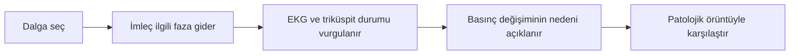

# Fizik muayeneye venöz basınç ve juguler nabız modülü eklenmesi

**Tarih:** 30 Eylül 2026  
**Durum:** Temel sürüm uygulandı (ikinci tur). Ek geliştirme planındaki JVP-01…05 kodda uygulandı ve test edildi (üçüncü tur); uzman içerik onayı ve hasta verisiyle doğrulama yapılmadı. Ayrıntı aşağıda "Uygulama durumu" ve "Ek geliştirme uygulama durumu" bölümlerinde. İlk turda yalnız rapor yazılmıştı.  
**Önerilen yer:** Fizik muayene → **Venöz basınç / Juguler venöz nabız**. Mevcut oskültasyon içeriğinin yanında ayrı sekme.

## Uygulama durumu (30 Eylül 2026)

Fizik muayene modunda (11) iki alt sekme var: **Oskültasyon** ve **Venöz basınç (JVP)**. Derse dört adım eklendi: dalgalar ve kalp döngüsü; triküspit yetersizliği/darlığı; konstriksiyon ve tamponadda y inişi; solunum ve Kussmaul.

| Rapor maddesi | Uygulama |
|---|---|
| Model (bölüm 3, 8) | `src/jvp-physiology.js`, DOM'suz. Şematik RA basıncı ortak döngü saatinin şablon fazında: a 0.40 (P'den sonra, ventrikül sistolünden önce), x 0.455, c 0.49 (QRS/S1), x′ ejeksiyonda, v kapalı kapakla 0.97, y kapak açılınca. Etiketler her senaryoda gerçek tepe/dip noktasında. Ortalama gerçek zaman ağırlıklı (`realTimeMean`). |
| Senaryolar (bölüm 4) | Normal, AF (a ve x yok; düzensiz RR modellenmez), TR (birleşik c-v, x′ yok, hızlı y), TS sinüs (büyük a, yavaş sığ y), konstriksiyon (derin hızlı y, x′ korunur), tamponad (y baskılanmış, x′ belirgin), cannon a (ileri; bağımsız atriyal saat yok, tek atım morfolojisi). İlk teslim önerisinden fazlası: yedi örüntünün hepsi. |
| Ortak parametre sözleşmesi (bölüm 7) | Normal, konstriksiyon ve tamponad ortalama RA basıncını `hemo-scenarios.js`'ten alır; kateterizasyon modülüyle çelişemez (testle sınanır). `hemodynamics.js` değiştirilmedi. |
| Ekran (bölüm 2) | Sabit 0–30 mmHg eksen (otomatik ölçek yok); aynı eksende kesikli normal referans; EKG ayrı eksende; S1/S2; triküspit açık bandı; ortak hareketli imleç. Dalga düğmesi, eğriye tıklama veya ok tuşları dalgayı seçer, kalbi o faza götürür ve dondurur; kart mekanizmayı açıklar. Kontroller: örüntü, normalle karşılaştır, etiketler, yavaş oynat (ortak saat 0.35 hız; moddan çıkınca geri alınır), dondur/oynat. |
| Solunum (bölüm 5) | Spontan inspiryum/ekspiryum seçimi: normalde ortalama 3 mmHg düşer, inişler derinleşir; konstriksiyonda yükselir (Kussmaul); tamponada otomatik Kussmaul verilmez ve not bunu söyler. Abdominojuguler yanıt ve ventilatör eklenmedi. |
| Birimler (bölüm 6) | Basınç mmHg; yatak başı değeri ayrı satırda: sternal açının üstünde yaklaşık cm (1 mmHg = 1.36 cmH2O, 5 cm varsayımı; varsayımın değiştiği yazılı). |
| Metin (bölüm 8) | `src/jvp-content.js`, TR/EN: dalga ve senaryo mekanizmaları, solunum notları, beş düşünme sorusu, kaynaklar, "sentetik şema, tanı aracı değil" etiketi. |
| Doğrulama (bölüm 9) | `scripts/test-jvp.mjs` (`npm test` içinde): dalga zamanlaması, patolojiler, solunum/Kussmaul, birimler, kateterizasyon çapraz testi, döngü sınırında süreklilik, TR/EN kapsamı. `npm run test:jvp`: alt sekmeler, ders adımları, dalga seçimi ile ortak saat, klavye, karşılaştırma, solunum, yavaş oynatmanın geri alınması, dil, telefon taşması. |

**Eksik özellikler (ikinci tur sonu):** uzman (kardiyoloji) içerik onayı; AF için düzensiz RR ve cannon a için bağımsız atriyal saat; abdominojuguler yanıt dersi; pozitif basınçlı ventilasyon. Uzman onayı dışındakiler üçüncü turda uygulandı (aşağıda).

**Veri niteliği:** Dalga yükseklikleri ölçülmüş hasta verisi değil, seçilmiş öğretim değerleridir. Bu özellik eksikliğinden ayrı bir model sınırlamasıdır; aşağıdaki geliştirmelerin tamamlanması genlikleri kendiliğinden klinik olarak doğrulamaz.

### Ek geliştirme planı: ritim, provokasyon ve veri doğrulaması

Bu bölüm, ikinci tur sonundaki eksikleri yapılacak işler olarak kaydeder ve plan metni olarak korunuyor. Uygulama durumu tablodan sonraki "Ek geliştirme uygulama durumu" alt bölümündedir.

| İş | Mevcut durum | Planlanan geliştirme | Kabul ölçütü |
|---|---|---|---|
| **JVP-01: AF zamanlaması** | AF yalnız dalga morfolojisiyle temsil ediliyor; düzensiz RR üretilmiyor. | Sabit tohumla tekrarlanabilen, fizyolojik sınırları uzmanla belirlenecek düzensiz ventriküler atım dizisi. EKG, JVP, kapak olayları ve imleç aynı olay zaman çizelgesini kullanmalı. | RR aralıkları değişken olmalı; aynı tohum aynı diziyi üretmeli. Organize a dalgası oluşmamalı. Duraklatma, yavaş oynatma ve yeniden başlatmada kanalların eşleşmesi korunmalı. |
| **JVP-02: Cannon a zamanlaması** | Bağımsız atriyal saat yok; tek atımın dalga biçimi gösteriliyor. | Atriyal ve ventriküler olay saatlerini ayır. Seçilen AV dissosiyasyon senaryosunda atriyal olay ile triküspit kapanma aralığının çakışmasını hesapla; dalgayı sabit faza yerleştirme. | Çakışan ve çakışmayan atımları içeren deterministik örnekte cannon a yalnız uygun zamanlama sırasında oluşmalı. Atriyal hız değişince çakışma örüntüsü değişmeli; triküspit darlığındaki büyük a ile mekanizma ayrımı korunmalı. |
| **JVP-03: Abdominojuguler yanıt dersi** | Ders ve zamana bağlı manevra yanıtı yok. | Başlangıç, uygulama, sürdürme ve bırakma evrelerini aynı grafikte göster. Geçici ve süren yanıtı karşılaştır; süre/eşik protokolünü kaynak ve sürüm bilgisiyle tanımla. | Uygulama başlangıcı ve bitişi görünür olmalı. Her basınç yükselişi pozitif sayılmamalı; değerlendirme seçilen protokolün zaman koşuluna dayanmalı. Sıfırlamada başlangıç durumuna dönmeli. |
| **JVP-04: Pozitif basınçlı ventilasyon** | Yalnız spontan solunum örneği mevcut; ventilatör senaryosu yok. | Ayrı solunum modu ve basınç zaman çizelgesi ekle. İnspirasyon/ekspirasyon işareti, referans basıncı ve varsa PEEP varsayımlarını açıkça tanımla. Spontan solunum eğrisini yalnız işaret değiştirerek yeniden kullanma. | Modlar ayrı parametrelerle sınanmalı. Solunum fazı ile JVP yanıtı eşleşmeli; parametre değişiminin beklenen yönü uzman tarafından onaylanmalı. Spontan solunuma ait yorumlar ventilatör moduna otomatik taşınmamalı. |
| **JVP-05: Genliklerin kökeni** | Dalga yükseklikleri sentetik öğretim değerleri. | Her senaryo için parametre, birim, gerekçe, kaynak, sürüm ve doğrulama durumunu kaydet. Grafik, açıklama ve dışa aktarımlarda “sentetik öğretim verisi” etiketini koru. Hasta verisiyle kalibrasyonu ayrı çalışma olarak planla. | Hiçbir sentetik seri “ölçülmüş” veya “klinik olarak doğrulanmış” sunulmamalı. Klinik doğrulama iddiası ancak veri kökeni, kullanım izni, yöntem ve bağımsız doğrulama sonuçları mevcutsa yapılmalı. |

**Sıra:** Önce veri niteliği etiketleri ve parametre kaydı; ardından ortak olay saati üzerinde AF ve cannon a; sonra abdominojuguler yanıt ve ventilatör dersleri. Son aşamada uzman içerik incelemesi ve eğitim pilotu. Ritim genişletmeleri mevcut sinüs ritmi, oskültasyon ve kateterizasyon davranışlarına karşı regresyon testinden geçmeli.

**Tamamlanma tanımı:** Özelliklerin görünmesi yeterli değil. Zamanlama testleri, kaynaklandırılmış senaryo varsayımları, TR/EN açıklamaları, kullanıcı etkileşim testleri ve uzman içerik onayı birlikte tamamlanmalı. Genliklerin hasta verisiyle doğrulanması ayrıca raporlanmalı.

### Ek geliştirme uygulama durumu (30 Eylül 2026, üçüncü tur)

Venöz basınç sekmesine **Görünüm** seçicisi eklendi: tek atım (önceki görünüm), AF ritim şeridi, AV dissosiyasyonu şeridi, abdominojuguler test ve pozitif basınçlı ventilasyon. Şeritler saniye cinsinden kendi saatinde oynar. Model `src/jvp-timeline.js` (DOM'suz), çizim `src/jvp-strip.js`, parametre kaydı `src/jvp-parameters.js`. Ventrikül döngüleri triküspit açılışında başlar ve `cardiac-cycle.js` hız bükmesini kullanır: kısa ya da uzun RR'yi diyastol karşılar. Basınç, EKG, kapak bandı, olay etiketleri ve imleç tek olay listesinden okunur. Şerit açıkken 3B kalbin kendi saati durur ve kalp şeridin ventrikül fazına konur; dondurma, yavaş oynatma (0.35) ve baştan başlatma yalnız şerit zamanını değiştirir. Oskültasyon sekmesine ya da tek atım görünümüne geçince kalbin kendi saati geri verilir. Derse iki adım eklendi: ritim şeritleri; abdominojuguler test ve ventilatör.

| İş | Uygulama | Test | Açık kalan |
|---|---|---|---|
| **JVP-01** | Sabit tohumlu (7) düzensiz RR dizisi, 12 atım, RR 0.45–1.10 s. a dalgası ve x inişi yok. EKG'de P yerine fibrilasyon dalgaları; frekansı şerit uzunluğuna tam sayı devir olarak oturtulduğu için döngü dikişsiz. | RR değişken; aynı tohum aynı dizi, başka tohum başka dizi; kapak kapanmadan önce atriyal tümsek yok; her R dalgası aynı saatin QRS olayında; dikişsiz döngü. Tarayıcıda: dondurmada kalp pozu şerit fazına eşit, yavaş oynatmada saat yaklaşık 0.35×, baştan başlatma t = 0. | RR sınırları uzman onayı bekliyor. AF'de atım uzunluğuna bağlı dalga boyu değişimi modellenmedi. |
| **JVP-02** | Ayrı atriyal ve ventriküler saatler: ventrikül 40/dk, atriyal hız seçilebilir (60/75/90; tam sayı atım için 75 yerine 74/dk kullanılıyor ve okumada yazıyor). Her atriyal kasılma (P + 0.11 s) o andaki kapak durumuna göre sınıflanır: triküspit açıksa a, kapalıysa cannon a. Dalga sabit faza yerleştirilmez. | Örnekte hem cannon hem sıradan a var; cannon yalnız kapak kapalıyken; cannon dalgaları a'dan ≥ 3 mmHg büyük; atriyal hız değişince örüntü değişir; triküspit darlığındaki büyük a açık kapakta (mekanizma ayrımı). | 3B model yalnız ventrikül saatini izler; atriyum kasılması ayrı gösterilmez. Genlikler uzman onayı bekliyor. |
| **JVP-03** | Protokol `ajr-teaching-v1` (kaynak: Wiese 2000 derlemesi; sürümlü): 5 s başlangıç, 10 s göbek çevresi bası (20–35 mmHg aralığı, burada 25), bırakma. Karın basısı ayrı kanalda, bası dönemi gölgeli; başlangıç ve "başlangıç + 4 cm" çizgileri grafikte. İki yanıt: normal (geçici) ve yüksek dolum basınçları (süren). Değerlendirme gizli yanıt eğrisinden değil, atım ortalamalı basınç sinyalinden yapılır: pozitif için basının son 5 saniyesinde yükselişin her an ≥ 4 cm sürmesi ve bırakmadan sonraki 3 s içinde ≥ 4 cm düşmesi gerekir. Sonuç yalnız bırakmadan 3 s sonra gösterilir. | Normal yanıtta tepe yükseliş eşiği geçer (+5.3 cm) ama sonuç negatif ve "yalnız geçici" işaretli; süren yanıt pozitif; evreler doğru; baştan başlatma başlangıç durumuna döner; zaman penceresi değişince sonuç değişir (tepe değil protokol karar verir). | Eşikler ve yanıt genlikleri uzman onayı bekliyor; protokoller kaynaklar arasında farklı. |
| **JVP-04** | Ayrı mod ve ayrı parametreler: 12 soluk/dk, I:E 1:2, plato 20 cmH2O, PEEP 0/5/10, hava yolu basıncının %35'i plevraya iletilir. Hava yolu basıncı ayrı kanalda, inspiryum gölgeli. Atmosfere göre ölçülen RA basıncı ventilatör inspiryumunda yükselir; PEEP ekspiryum sonu düzeyini artırır; okuma noktası ekspiryum sonu. Spontan solunum düğmesi ve Kussmaul notları bu modda gizli. Yalnız normal örüntüyle. | İnspiryumda ortalama basınç ekspiryumdan yüksek; solunum fazı hava yolu basıncıyla eşleşiyor; PEEP 10 > PEEP 0 ekspiryum sonu düzeyi; mod parametreleri spontan parametrelerden ayrı; tarayıcıda PEEP değişince okuma artıyor, spontan not gizli. | İletim oranı ve yön uzman onayı bekliyor. Venöz dönüş ve kalp debisi etkisi modellenmedi. |
| **JVP-05** | `src/jvp-parameters.js`: her senaryo ve şerit için değer, birim, gerekçe, kaynak anahtarı, sürüm (`jvp-params-2026-09-30`) ve durum. Yalnız iki durum var: "öğretim değeri" ve "uzman onayı bekliyor"; "ölçülmüş" veya "klinik doğrulanmış" durumu tanımlı değil. Etiket grafikte (sağ üst), panel metninde ve CSV dışa aktarımında. Panelde "Parametre kaydı" listesi. Yeni **CSV indir** düğmesi: başlıkta veri etiketi, parametre sürümü ve kullanılan parametreler. | Her kapsamın kaydı var; hiçbir durum ölçülmüş/doğrulanmış demiyor; her kayıtta birim, gerekçe, kaynak ve sürüm var; CSV'de etiket ve parametreler; tarayıcıda indirilen dosyada etiket, sürüm ve sütunlar. | Hasta verisiyle kalibrasyon ayrı çalışma olarak planlanmadı. |

**Doğrulama:** `scripts/test-jvp-timeline.mjs` (`npm test` içinde) ve genişletilmiş `scripts/test-jvp-browser.cjs` (`npm run test:jvp`; telefon genişliğinde şerit taşma testi dâhil). Kod kontrolü, birim testleri, derleme ve 15 tarayıcı testinin hepsi geçti. Mevcut sinüs ritmi, oskültasyon ve kateterizasyon davranışları için regresyon: tüm tarayıcı paketi ve `test-jvp.mjs`'teki kateterizasyon çapraz testi değişmeden geçti.

**Hâlâ tamamlanmadı (tamamlanma tanımına göre):** uzman içerik onayı, eğitim pilotu, genliklerin hasta verisiyle doğrulanması. Bu nedenle özellikler "uygulandı ve test edildi" durumundadır; "tamamlandı" sayılmaz.

## 1. Modülün amacı

Amaç dalga isimlerini ezberletmek değil, sağ atriyum basıncının neden yükselip düştüğünü kalp döngüsüyle birlikte öğretmek. Kullanıcı sonunda:

- Ortalama basınç yüksekliği ile dalga biçimini ayırabilmeli.
- a, c, v dalgalarını; x, x′ ve y inişlerini mekanizmalarıyla açıklayabilmeli.
- Normal örüntüyü triküspit yetersizliği, triküspit darlığı, atriyal fibrilasyon, konstriksiyon ve tamponadla karşılaştırabilmeli.
- Normal inspiratuvar yanıtı Kussmaul bulgusundan ayırabilmeli.
- Boyunda görülen venöz nabız, sternal açıya göre yükseklik ve kateterle ölçülen sağ atriyum basıncının aynı veri olmadığını anlayabilmeli.

Kapsam erişkin kardiyovasküler fizik muayene eğitimidir. İlk sürüm, sentetik fizyoloji şeması olmalı; hasta kaydı veya tanı aracı olarak sunulmamalı. JVP, sağ kalp hemodinamiğine ilişkin bilgi sağlar; tek bulgu tek başına hastalık tanısı koydurmaz. [1,2]

## 2. Ekran tasarımı

Önerilen ana ekran üç eşzamanlı bölümden oluşur:

| Bölüm | İçerik | Öğrenme katkısı |
|---|---|---|
| Üst grafik | Şematik sağ atriyum basınç eğrisi, a/c/v ve x/x′/y etiketleri; kesikli normal referans | Dalga biçimi ve ortalama basınç ayrımı |
| Zaman referansı | EKG, S1/S2, triküspit açık/kapalı bandı; ortak hareketli imleç | Elektriksel olay ile mekanik basınç değişiminin ilişkisi |
| Fizyoloji kartı | Seçilen dalganın nedeni, kalpteki karşılığı, örüntüdeki değişiklik | Grafikten mekanizmaya geçiş |

Kontroller: **Normal / Senaryo seç**, **Normalle karşılaştır**, **Dondur**, **Yavaş oynat**, **Fazı sürükle**, **İnspiryum–ekspiryum**, **Etiketleri göster/gizle**. Dalgaya tıklama ilgili faza götürür; klavye ile aynı işlem yapılabilir.

Grafik yatay ekseni zaman veya kardiyak döngü yüzdesi, dikey ekseni açıkça **şematik RA basıncı, mmHg** olmalı. EKG ayrı eksende gösterilmeli. Şekli anlamak için isteğe bağlı normalize görünüm sunulursa bunun mutlak basınç karşılaştırması olmadığı belirgin yazılmalı.

Normal ve patolojik eğri aynı eksen aralığında karşılaştırılmalı. Her senaryoda otomatik ölçek değiştirip yüksek basıncı normalle aynı yükseklikte göstermekten kaçınılmalı. Basınç ve renk tek açıklama olmamalı; etiket ve kısa mekanizma metni birlikte bulunmalı.

Örnek kullanıcı akışı:

Bu düzen ürün önerisidir; henüz ekran veya grafik oluşturulmadı.

## 3. Normal dalga fizyolojisi

| Bileşen | Temel mekanizma | Zaman ilişkisi |
|---|---|---|
| **a** | Sağ atriyum kasılmasıyla basınç yükselmesi | P dalgasından sonra, ventrikül sistolünden önce |
| **c** | Erken ventrikül sistolünde triküspit kapağın atriyuma kabarması; boyun kaydında karotis iletiminin de katkısı olabilir | QRS/S1 çevresi |
| **x** | Atriyal gevşemeyle basınç düşmesi | a dalgasından sonra |
| **x′** | Ventrikül sistolünde triküspit anülüsünün aşağı hareketiyle atriyal kapasitenin artması | Sistol sırasında |
| **v** | Triküspit kapalıyken venöz dönüşle sağ atriyumun dolması | Geç sistol/kapak açılışı öncesine uzanan yükseliş |
| **y** | Triküspit açılınca sağ atriyumun ventriküle boşalması | Erken diyastol |

Klinik kaynakların bir bölümünde “x inişi” terimi x ve x′ bileşenlerini birlikte adlandırır. Bu raporun ayrıntılı senaryo tablolarında sistolik anülüs hareketiyle ilişkili iniş x′ olarak belirtilir. Temel anlatımda x/x′ birleşik gösterilebilir; “ayrıntı” açıldığında mekanizmaları ayrılmalı. c dalgası klinik gözlemde her zaman seçilemez. Eğitim şeması tüm dalgaları görünür yapsa bile boyunda aynı netlikte görüleceği söylenmemeli. [1–3]

Öğretim mesajı: **Basınç inişi akışın durması değildir.** Özellikle sistolik x′ inişi, sağ atriyuma venöz akışın artmasıyla birlikte olabilir. Basınç ve akımın ayrı büyüklükler olduğu kısa bir ok animasyonuyla açıklanabilir. [1]

## 4. Karşılaştırmalı senaryolar

| Senaryo | Grafikte vurgulanacak değişiklik | Açıklama / sınır |
|---|---|---|
| **Normal sinüs ritmi** | Organize a; c/v; x/x′ ve y | Diğer senaryolar için referans |
| **Atriyal fibrilasyon** | Organize a dalgasının kaybı | Tam ritim simülasyonu varsa düzensiz RR de gösterilmeli. [2] |
| **Triküspit yetersizliği** | Belirgin, birleşebilen sistolik c-v; sistolik x′ inişinde azalma; hızlı y | Sistolde sağ atriyuma geri akım. Özellikler özellikle belirgin TR örüntüsü içindir. [4] |
| **Triküspit darlığı, sinüs ritmi** | Büyük a ve yavaş y | Atriyal boşalmaya direnç; AF eşlik ederse büyük organize a beklenmez. [5] |
| **Konstriktif perikardit** | Belirgin hızlı y; x′ de korunabilir/belirgin olabilir | Erken doluş ardından kısıtlanma. Kussmaul eşlik edebilir; zorunlu bulgu gibi kodlanmamalı. [1,6] |
| **Kardiyak tamponad** | Korunmuş/belirgin sistolik x′, zayıf veya kayıp y | Erken diyastolik doluş kısıtlanır. Saf tamponada otomatik Kussmaul davranışı verilmemeli. [7] |
| **Cannon a, ileri ders** | Kapalı triküspide karşı atriyal kasılmada büyük basınç yükselişi | AV zamanlama ilişkisi gösterilmeli; triküspit darlığındaki büyük a ile aynı mekanizma değildir. [2] |

**İlk teslim önerisi:** Normal + TR + konstriksiyon + tamponad. Böylece dalga morfolojisi ve en belirgin iki karşılaştırma erken doğrulanır. Sonraki aşamada AF ve TS; bağımsız atriyal/ventriküler zamanlama kurulduğunda cannon a eklenir. Bütün senaryolar geliştirme planında korunur.

Senaryo isimleri “kesin tanı” düğmesi gibi çalışmamalı. Örneğin “bu şemada y inişi baskılanmış” geri bildirimi, “hastada tamponad var” sonucuna dönüştürülmemeli.

## 5. Solunum ve venöz dönüş dersi

Ayrı bir solunum şeridi, basınç eğrisinin altında gösterilmeli. İlk sürümde kontrollü inspiryum/ekspiryum seçimi yeterli; sonraki sürümde sürekli solunum animasyonu eklenebilir.

- **Spontan inspiryum:** Normalde juguler venöz basınç azalır. Negatif intratorasik basınç ve sağ kalbe dönüş arasındaki ilişki açıklanır.
- **Kussmaul:** İnspiryumda beklenen düşüşün olmaması veya yükseliş. Artan dönüşün sağ kalp tarafından kabul edilmesindeki kısıtla ilişkilendirilir; konstriksiyon ve bazı sağ kalp hastalıklarında görülebilir. [6]
- **Tamponad karşılaştırması:** “Boyun venleri dolgun” ile “Kussmaul var” eşitlenmemeli. [7]
- **Pozitif basınçlı ventilasyon:** İlk modül spontan solunuma göre tanımlanmalı. Ventilatör seçeneği eklenirse aynı solunum işareti doğrudan yeniden kullanılmamalı.

Abdominojuguler yanıt ayrı bir zaman grafiğiyle sonraki derse eklenebilir: uygulama başlangıcı, basınç altında sürdürme ve bırakma. Geçici yükseliş ile süren yükseliş karşılaştırılır. Yayınlarda süre/eşik tanımları farklılaşabildiği için seçilen protokol kaynaklandırılmalı; her yükseliş “pozitif” sayılmamalı. Bu rapor uygulama kuvveti veya hasta başı işlem reçetesi tanımlamaz. [8]

## 6. Basınç, yükseklik ve ölçüm birimleri

İki görünüm ayrı sunulmalı:

1. **Fizyoloji görünümü:** Sağ atriyum basınç şeması, mmHg. Mutlak değerler seçilmiş eğitim parametreleri olarak etiketlenir.
2. **Yatak başı görünümü:** Sternal açıya göre venöz kolonun dikey yüksekliği, cm. Boyun yüzeyi boyunca eğik mesafe ölçülmez. Referans düzeyi ve hasta pozisyonu belirtilir.

Geleneksel “ölçülen yüksekliğe 5 cm ekle” yaklaşımı gösterilecekse bunun yaklaşık anatomik varsayım olduğu yazılmalı. Sternal açı–sağ atriyum ilişkisi her vücut yapısı ve pozisyonda sabit değildir; bilimsel çalışma bu sınırlamayı destekliyor. Boyundaki cm ölçümü doğrudan mmHg etiketiyle sunulmamalı. [2,9]

Normal a/v genliği veya ortalama basınç için tek değişmez sayı ezberletilmemeli. Basınç yüksekliği tek başına toplam kan hacmini veya sıvı tedavisine yanıtı ölçmez; modelin amacı mekanizmayı açıklamaktır.

## 7. Mevcut koddan yararlanma

| Kaynak | Mevcut yetenek | Önerilen kullanım |
|---|---|---|
| `src/exam-mode.js` | Panel oluşturma, giriş/çıkış, `tick`, dil değişimi | Oskültasyon ve venöz basınç alt panellerini yönetmek |
| `src/exam-panel.js`, `src/exam-panel.css` | Fizik muayene seçicileri, grafik ve açıklama kalıpları | Tasarım dili ve erişilebilir kontrol örnekleri |
| `src/cardiac-cycle.js` | Ortak faz, BPM, durdurma; `phaseToTime`, `timeToPhase` | EKG, kapak ve basınç imlecini eşzamanlamak |
| `src/hemodynamics.js:104` | `atrialWaveFactory`, a/v hedefleri, x/y şekilleri | Mevcut sağ atriyum eğrisinden başlamak; öğretim gereksinimlerini ayrıca sınamak |
| `src/hemodynamics.js:131` | Gerçek zaman ağırlıklı ortalama | Basınç ortalamasını faz üzerinden yanlış hesaplamamak |
| `src/hemodynamics.js:141` | Solunum ve `kussmaul` bayrağı | Senaryo eşleşmesini doğrulayarak kullanmak |
| `src/main.js` | Muayene moduna ortak saat ve dil aktarımı | İlk entegrasyonu mevcut mod içinde tutmak; gereksiz ana uygulama değişikliğinden kaçınmak |

**Somut sınırlama:** Mevcut atriyal eğride a tepesinden sonra 0.47 fazındaki ara değer, ardından x çukuru var. Bu bölüm kendi başına ayrı bir c tepeciği üretmeyebilir. Yalnız “c” etiketi eklemek yeterli değil; omuz niteliği açıklanmalı veya ayrıntılı öğretim eğrisi ayrıca oluşturulmalı. Mevcut kateterizasyon grafiklerini değiştirirken regresyon riski doğar.

Öneri: Önce mevcut fonksiyonu değiştirmeden venöz eğitim katmanı kur; ancak aynı senaryoda farklı modüllerin çelişkili basınç üretmesini önlemek için ortak parametre sözleşmesi ve çapraz test ekle. Ayrı eğri gerekirse “ayrıntılı öğretim şeması” olarak açıkça ayır.

AF ve cannon a için yalnız sinüs döngüsüne sabit bir tepe koymak uygun değil. Mevcut saat olay sayacı/bağımsız atriyal saat sağlamıyorsa, önce yalnız morfoloji karşılaştırması gösterilmeli; EKG'nin tam aritmi modeli olmadığı belirtilmeli.

## 8. Önerilen geliştirme yapısı

Henüz oluşturulmamış dosya önerileri:

- `jvp-physiology.js`: Dalga üretimi, senaryolar ve solunum yanıtı; DOM bağımsız.
- `jvp-content.js`: Türkçe/İngilizce açıklamalar, kaynak bağlantıları ve öğrenme soruları.
- `jvp-panel.js`, `jvp-panel.css`: Grafik, imleç, karşılaştırma ve faz kartları.
- `scripts/test-jvp.mjs`: Mekanizma ve matematik kontrolleri.
- `scripts/test-jvp-browser.cjs`: Görünürlük, kontroller, dil ve mobil düzen.

İlk sürüm yeni kütüphane gerektirmiyor; mevcut Canvas/SVG ve panel altyapısı yeterli adaylar. Bu mimari önerisi, performansın ölçüldüğü anlamına gelmez.

Grafik katmanı girişler değişince yeniden örneklenmeli; her karede yalnız imleç güncellenebilir. Gizli sekmede çizim ve ses durmalı. Moddan çıkış mevcut muayene durumunu bozmamalı.

## 9. Doğrulama ve kabul ölçütleri

| Alan | Kontrol |
|---|---|
| Normal fizyoloji | a, P sonrası ve ventrikül sistolü öncesinde; y kapak açılışından sonra; v kapalı kapak doluşuyla uyumlu |
| İnişlerin ayrımı | x gevşeme, x′ anülüs inişi olarak ayrı açıklanıyor |
| Patoloji | Tamponadda y baskılanıyor; konstriksiyonda hızlı y; TR'de sistolik c-v ve azalmış x′; TS'de sinüs ritminde büyük a/yavaş y |
| Ritim | AF'de organize a yok; cannon a yalnız uygun AV zamanlamasında |
| Solunum | Normal spontan inspiryumda düşüş; Kussmaul seçeneğinde düşmeme/yükselme; saf tamponadda otomatik Kussmaul yok |
| Matematik | Sonlu örnekler, döngü sınırında süreklilik, belirtilen gerçek zaman ortalaması; farklı BPM'de doğru zaman dönüşümü |
| Birimler | RA mmHg ile sternal açı üzerinden cm ayrılmış; normalize grafikte mutlak değer iddiası yok |
| UI | Dalga tıklama ve klavye seçimi aynı açıklamayı açıyor; dondurma tutarlı; normal karşılaştırma eksenleri aynı |
| Entegrasyon | Dil geçişi, sekme değişimi, moddan çıkış/dönüş ve mobil taşma testleri |
| İçerik | Eko/kardiyoloji uzmanı grafikleri ve mekanizma metinlerini onaylıyor; sentetik veri etiketi görünür |

Geliştirme yapılınca çalıştırılacak kontroller: yeni model testi; `npm run check`; `npm test`; `npm run build`; ayrıca muayene/JVP tarayıcı testi. Bu rapor aşamasında yeni modül veya test dosyası oluşturulmadığı için bu kontroller çalıştırılmış sayılmaz.

Örnek öğrenme soruları:

- “Triküspit açıldığı halde y inişi neden belirgin değil?”
- “Büyük a ile cannon a arasındaki mekanizma farkı ne?”
- “Basınç düşerken venöz akım artabilir mi?”
- “Normal inspiryumda JVP azalırken sağ kalbe dönüş nasıl artıyor?”
- “Aynı ortalama basınçta iki farklı dalga biçimi ne anlatır?”

## 10. Araştırma ve kaynak denetimi notları

Kaynak kodu salt okunur incelendi; mevcut değişiklikler korunmuştur. Kod grafiği bu projeyi içermediğinden doğrudan dosyalara geçildi. Uygulama üretimi kullanıcı talebiyle rapora çevrildi; görevlendirilen model alt ajanı da dosya yazmadığını doğruladı.

Klinik içerik için NCBI/PMC, Merck ve Stanford kaynakları karşılaştırıldı. Bazı tam metin istekleri reCAPTCHA veya 403 verdi; bu kaynakların erişilebilir indeks özetleri kullanıldı ve tam metin okunmuş gibi gösterilmedi. Ranganathan–Sivaciyan makalesinin DOI ve metaverisi Scite ile doğrulandı; Scite bu sorguda kullanılabilir tam metin pasajı veya editorial notice alanı döndürmedi. Atıf sayısı fizyolojik iddianın bağımsız doğrulanması sayılmadı.

**Kaynak çelişkisi:** Stanford sayfasındaki “Other signs” bölümü Kussmaul'u tamponadla ve Friedreich bulgusunu x ile ilişkilendiriyor. Bu iki ifade bu raporun öğretim modeline aktarılmadı. Y inişi ve saf tamponad ayrımı, diğer klinik kaynaklarla karşılaştırılarak yukarıdaki biçimde kuruldu. Ayrı içerik incelemesinde x/x′ terminolojisi tutarlılığı düzeltildi. İnsan uzman incelemesi hâlâ gerekli.

Bu rapor sistematik derleme değildir. Hasta verisi, etki büyüklüğü veya yeni klinik sonuç hesaplanmadı. Mevcut grafikteki sayısal genlikler seçilmiş temsili öğretim parametreleridir; ölçülmüş hasta verisi değildir. Kaynaklardan görsel kopyalanması önerilmiyor; özgün şemalar üretilmeli.

## Kaynaklar

Erişim tarihi: 30 Eylül 2026.

1. Ranganathan N, Sivaciyan V. **Jugular Venous Pulse Descent Patterns: Recognition and Clinical Relevance.** CJC Open, 2023. DOI: [10.1016/j.cjco.2022.11.016](https://doi.org/10.1016/j.cjco.2022.11.016). [PMC kaydı](https://pmc.ncbi.nlm.nih.gov/articles/PMC10066450/). x/x′/y mekanizmaları ve venöz akım ilişkisi; erişilebilir indeks içeriği ve Scite metaverisi.
2. Stanford Medicine 25. [Neck Vein Examination & Wave Forms](https://med.stanford.edu/stanfordmedicine25/the25/neck-exam-jugular-venous-pressure-measurement.html). Ölçüm yaklaşımı, AF ve cannon a; “Other signs” bölümündeki çelişkiler için yukarıdaki not geçerli.
3. **The Jugular Venous Pressure and Pulse Contour.** Clinical Methods, 3. baskı. [NCBI Bookshelf](https://www.ncbi.nlm.nih.gov/books/NBK300/?report=printable). Dalga ve inişler; erişilebilir indeks bölümleri.
4. Merck Manual Professional. [Tricuspid Regurgitation](https://www.merckmanuals.com/professional/cardiovascular-disorders/valvular-disorders/tricuspid-regurgitation). Belirgin c-v ve y örüntüsü.
5. Merck Manual Professional. [Tricuspid Stenosis](https://www.merckmanuals.com/en-ca/professional/cardiovascular-disorders/valvular-disorders/tricuspid-stenosis). Büyük a ve yavaş y; sinüs ritmi koşulu ayrıca dikkate alınmalı.
6. Merck Manual Professional. [Cardiovascular Examination](https://www.merckmanuals.com/en-ca/professional/cardiovascular-disorders/approach-to-the-cardiac-patient/cardiovascular-examination?media=print). Venöz basınç ve Kussmaul bulgusu.
7. StatPearls. [Cardiac Tamponade](https://www.ncbi.nlm.nih.gov/books/NBK431090/?report=printable); ayrıca [Tamponade: Hemodynamic and Echocardiographic Diagnosis, PubMed](https://pubmed.ncbi.nlm.nih.gov/29137910/). Saf tamponadda Kussmaul ayrımı ve baskılanmış y; erişilebilir indeks özetleri.
8. [The abdominojugular reflux sign, PubMed](https://pubmed.ncbi.nlm.nih.gov/10936479/), DOI: 10.1016/S0002-9343(00)00443-5; [Hepatojugular Reflux, NCBI](https://www.ncbi.nlm.nih.gov/books/NBK526097/). Geçici/süren yanıt ayrımı ve protokol farklılıkları.
9. **How Far Is the Sternal Angle from the Mid-right Atrium?** [PMC](https://pmc.ncbi.nlm.nih.gov/articles/PMC1495124/). Sternal açı–sağ atriyum uzaklığının sabit olmadığına ilişkin birincil çalışma; erişilebilir indeks özeti.
